# ModDB Tracker

> A desktop tracker for your [ModDB](https://www.moddb.com) mods, addons and files — downloads, visits, watchers, ranks and community activity, with interactive charts, background polling and Windows notifications.


---

## Screenshots

All screenshots below are rendered from the real application UI using a generated sample dataset.

| Dashboard | My Mods |
| --- | --- |
| 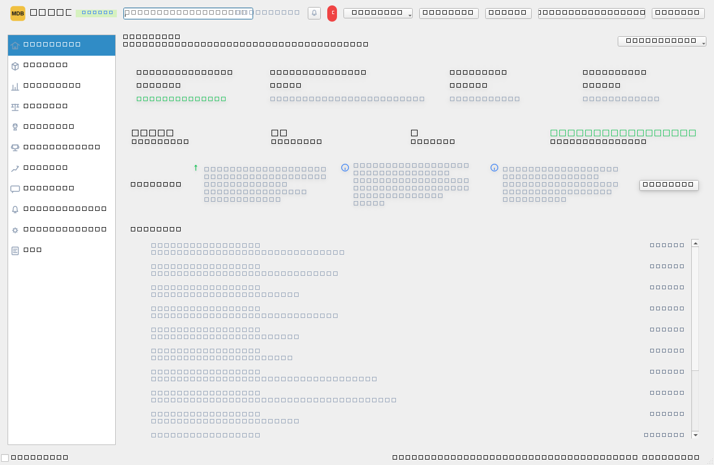 | 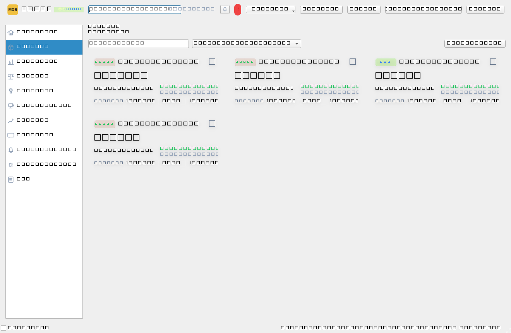 |

| Analytics — cumulative downloads | Analytics — comments activity |
| --- | --- |
| 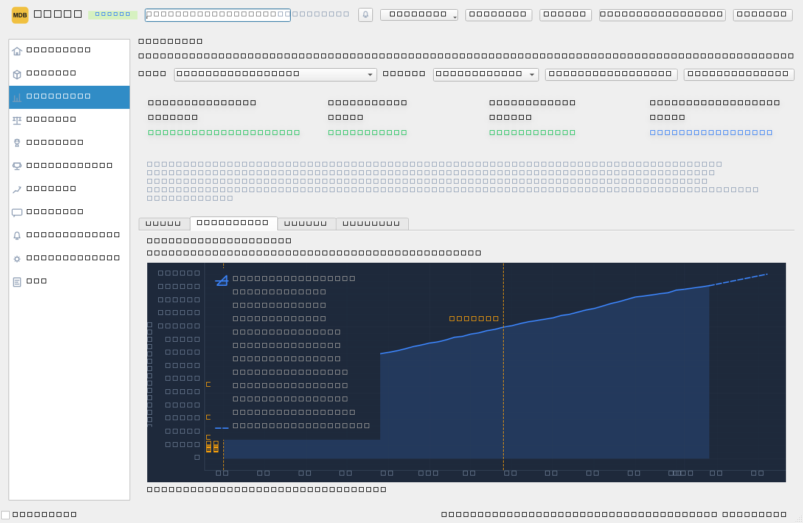 | 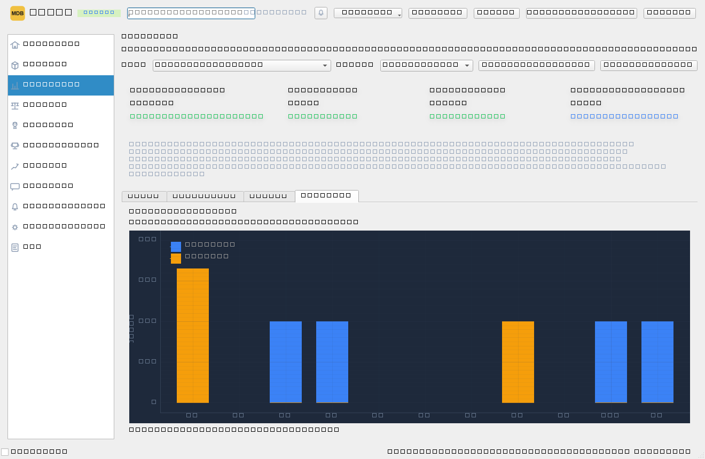 |

| History — rank over time | Compare mods |
| --- | --- |
| 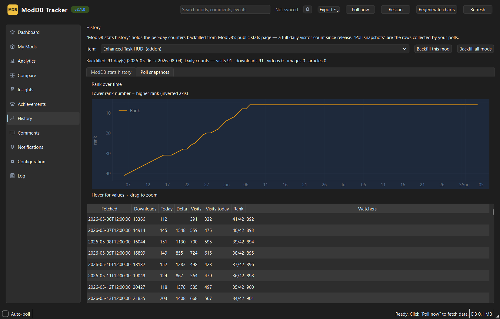 | 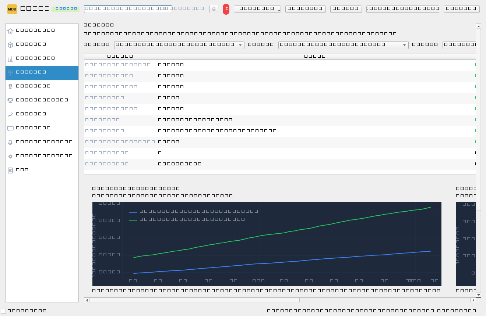 |

| Comments feed | Notifications |
| --- | --- |
| 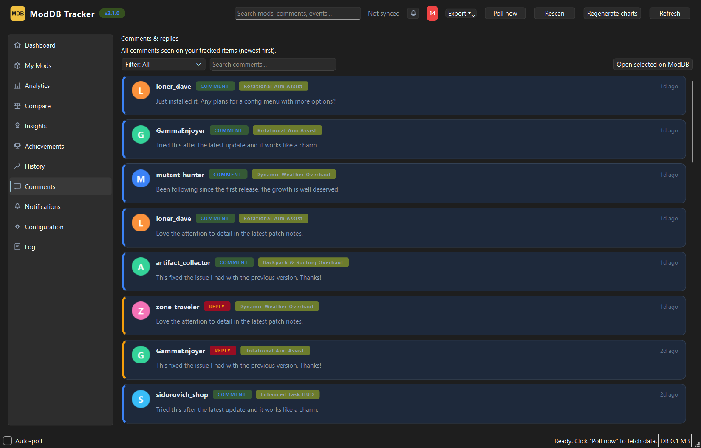 | 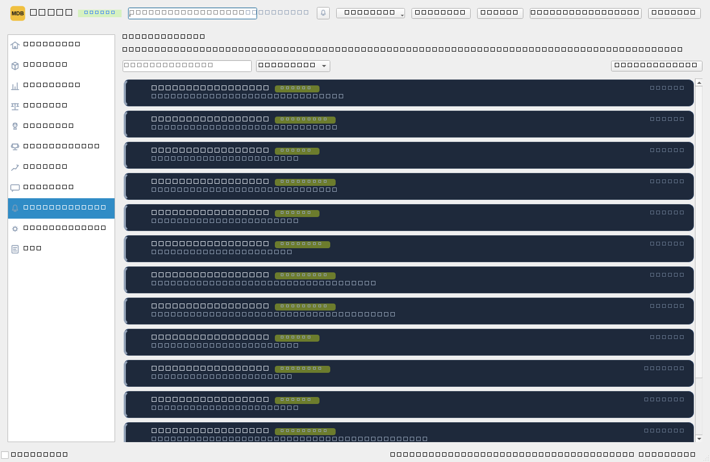 |

| Insights | Achievements |
| --- | --- |
| 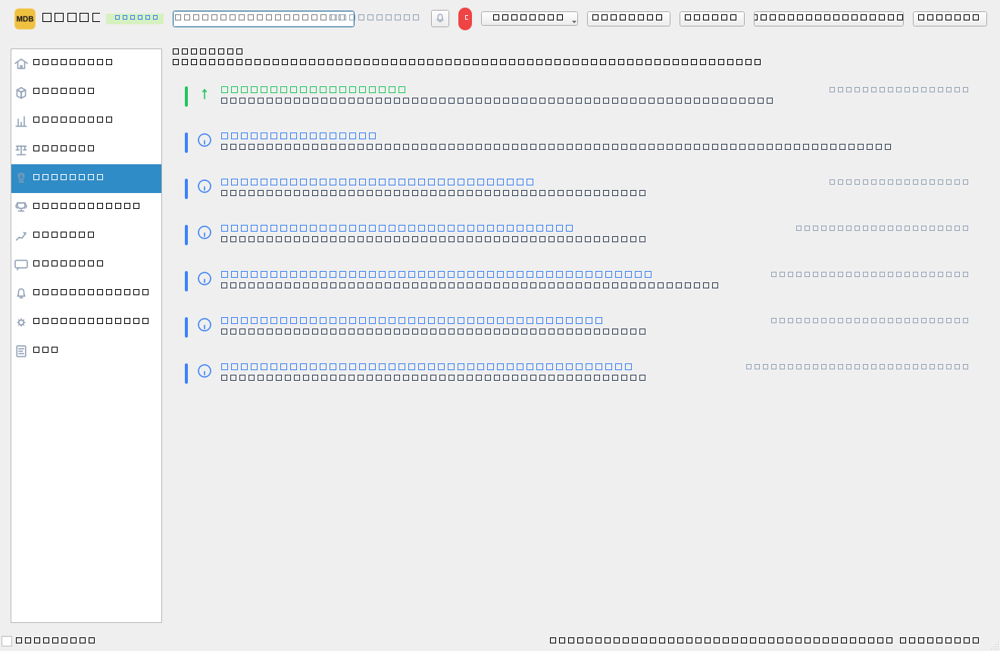 | 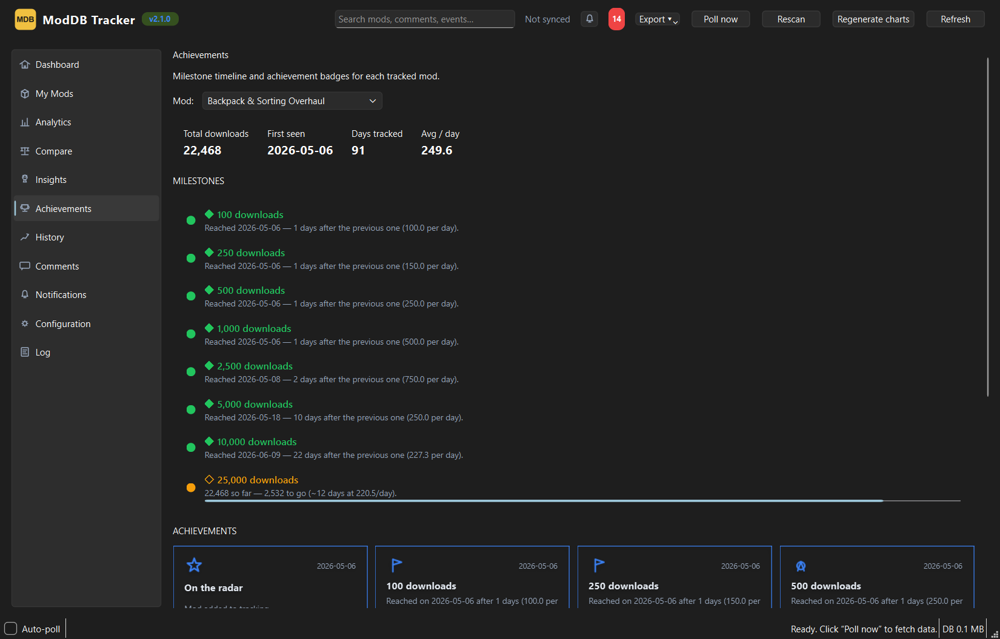 |

| Configuration | History — backfilled ModDB stats |
| --- | --- |
| 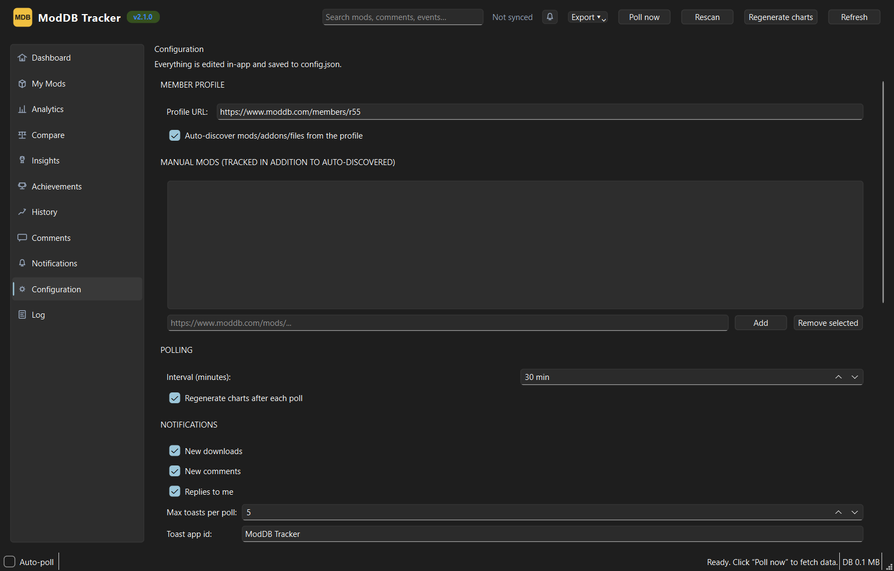 | 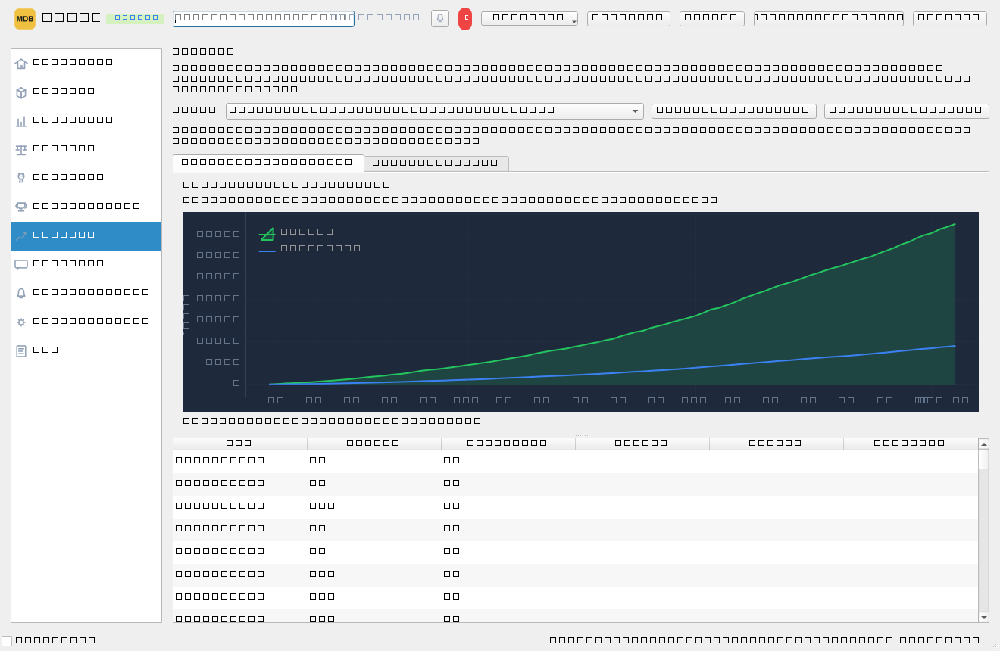 |

## Generated reports

A single poll also renders shareable PNG reports into `output\` (matplotlib, dark theme to match the UI):

| Overview | Downloads per day |
| --- | --- |
| 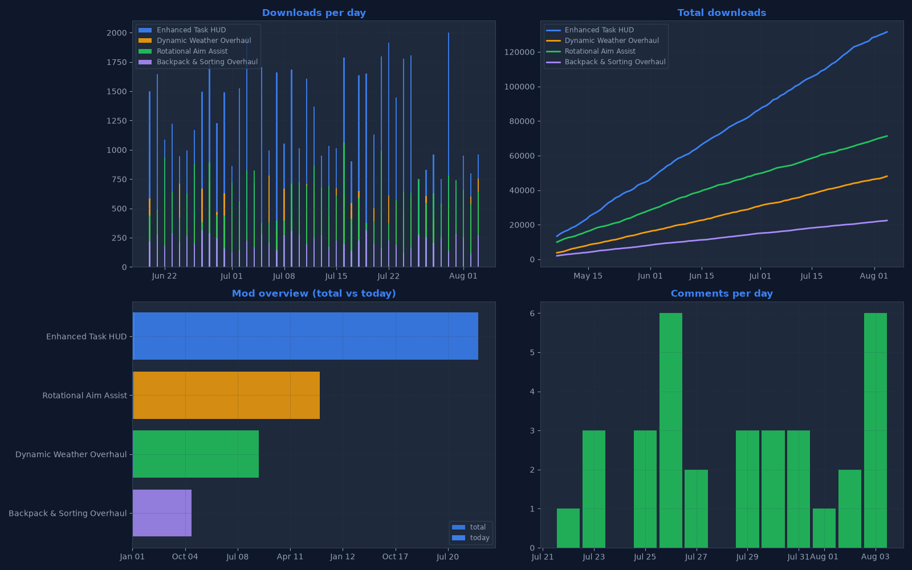 | 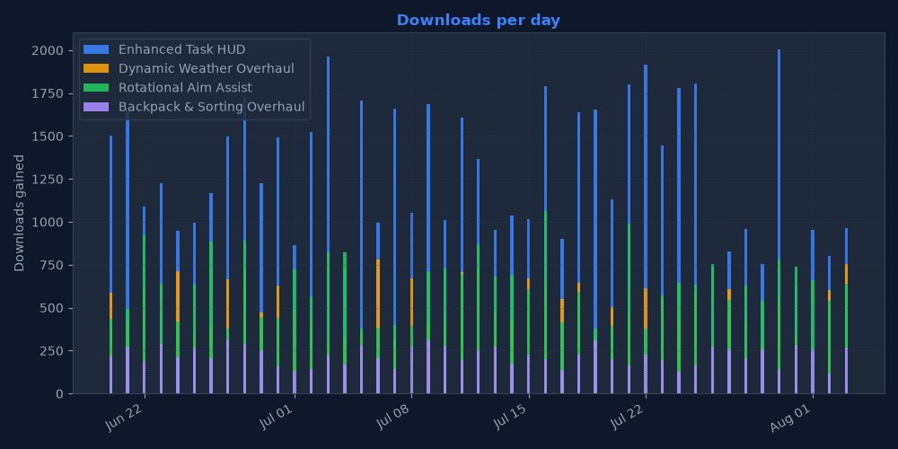 |

| Total downloads | Comment activity |
| --- | --- |
| 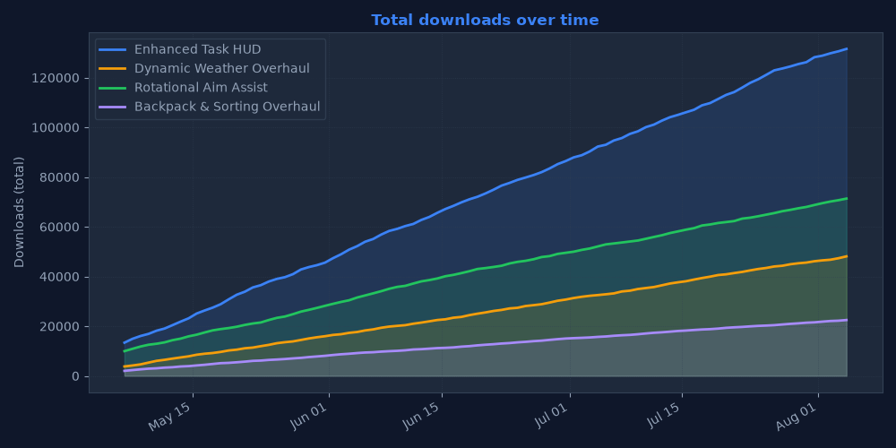 | 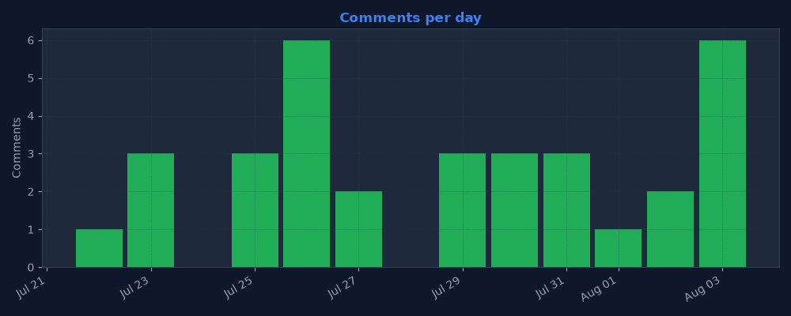 |

## Features

- **Track anything on your profile** — auto-discovers your mods, addons and downloads from your member page, or add individual mod URLs by hand.
- **Live counters** — total + today's downloads, visits, watchers, rank, rating and files, captured on every poll.
- **Interactive analytics** — per-mod or aggregate charts in 30/60/90-day windows:
  - **Daily** downloads with a 7-day moving average
  - **Cumulative** totals with milestones (e.g. 100k) and a 7-day projection
  - **Weekly** download gains
  - **Comments activity** — stacked comments vs. replies per day
  - Zoom, pan, hover tooltips and right-click **Export chart as PNG** on every chart.
- **Milestone tracking** — automatic markers when a mod crosses download thresholds.
- **Rank-over-time** chart per mod, built from your poll snapshots.
- **History backfill** — pulls the full per-day stats history ModDB publishes for a mod, stored locally.
- **Comments & replies** — every new comment is captured with author and timestamp; replies are threaded.
- **Notifications** — Windows toast when downloads, comments or replies change, plus an in-app notification feed with an unread badge.
- **Insights** — automated plain-math takeaways from your recent history (best day, growth rates, trends).
- **Achievements** — progress badges for tracking milestones.
- **Compare** — side-by-side view of any two mods.
- **Search** — cross-data search across mods, comments, events and history.
- **Reports & export** — CSV, Excel (.xlsx), PDF report and JSON export of everything in the database; one-click chart regeneration.
- **Themes** — Dark, Light, Nord, Nord Light, Dracula, Solarized Dark/Light, switchable live from Settings (no restart), plus adjustable font size and sort/filter on the mods page.
- **Background mode** — polls on a timer with a system tray icon and no console window.

## Installation

Requires **Python 3.10+** on Windows (toast notifications need an interactive session; the CLI works on any OS).

```powershell
# from inside the project folder
python -m venv .venv
.venv\Scripts\pip install -r requirements.txt
```

## Configuration

Everything can be edited in the GUI (**Configuration** page), or by hand in `config.json`:

| Key | Default | Description |
| --- | --- | --- |
| `profile_url` | — | Your ModDB member page, e.g. `https://www.moddb.com/members/yourname` |
| `auto_discover` | `true` | Scan the member profile's mods / addons / downloads tabs automatically |
| `mods` | `[]` | Manual list of mod URLs to track (used when `auto_discover` is off, or in addition to it) |
| `poll.interval_minutes` | `30` | Auto-poll interval in the GUI / scheduled task |
| `poll.notify_on_downloads` | `true` | Toast when downloads change |
| `poll.notify_on_comments` | `true` | Toast when a new comment appears |
| `poll.notify_on_replies` | `true` | Toast when a new reply appears |
| `poll.charts_each_poll` | `true` | Regenerate `output\` PNG reports on every poll |
| `tray.minimize_to_tray` | `true` | Close button hides the window instead of quitting |
| `tray.start_minimized` | `false` | Start hidden in the tray |
| `ui.theme` | `dark` | `dark`, `light`, `nord`, `nord-light`, `dracula`, `solarized-dark`, `solarized-light` |
| `ui.fullscreen` | `false` | Start maximized |
| `ui.analytics_days` | `60` | Default analytics range |
| `ui.dashboard.*` | — | Toggle dashboard stat cards, insights, activity feed and its position |

## First run

```powershell
.venv\Scripts\python tracker.py --init
```

Discovers your content, stores a baseline snapshot for every item and writes the
first charts to `output\`.

## Usage

### GUI

```powershell
.venv\Scripts\python gui.py
# start hidden in the system tray:
.venv\Scripts\python gui.py --minimized
```

Eleven pages, reachable from the sidebar:

- **Dashboard** — member totals, top stats, and a live activity feed of the latest events
- **My Mods** — card grid of every tracked item with totals, today's gain, growth and rank; right-click for favorite / remove / export, double-click to open the ModDB page
- **Analytics** — the interactive chart suite described above
- **Compare** — two-mod comparison
- **Insights** — auto-generated takeaways
- **Achievements** — unlocked tracking milestones
- **History** — backfilled ModDB stats + poll snapshot log with rank-over-time
- **Comments** — every captured comment and reply
- **Notifications** — recent events with an unread badge in the top bar
- **Configuration** — all settings in-app (profile, mods, polling, tray, theme) plus a raw-JSON editor
- **Log** — live log output

The toolbar adds **Poll now**, **Rescan profile**, **Refresh** and an **Export** menu
(CSV / Excel / PDF / JSON). The **Auto-poll** checkbox in the status bar polls every
`poll.interval_minutes`.

### System tray / background mode

- A tray icon is added on start (right-click: Show/Hide, Poll now, Rescan profile, Quit).
- Closing the window minimizes to the tray by default — polling and toasts keep running.
  Use **Quit** in the tray menu to fully exit.
- Left-click the icon toggles the window; hovering shows your member name and last poll time.
- `--minimized` (or the setting) starts the app hidden in the tray.

Polls run in a background thread so the UI never freezes; toasts fire regardless.
The GUI and the CLI share the same SQLite database, so either can be used.

### CLI

| Command | What it does |
| --- | --- |
| `tracker.py --init` | First run: discover, baseline snapshot, charts |
| `tracker.py --poll` | Run one poll cycle (fetch, compare, notify, charts) |
| `tracker.py --report` | Print a stats table |
| `tracker.py --charts` | Regenerate `output\` charts only |
| `tracker.py --discover` | Re-scan the profile for new mods |
| `tracker.py --poll --notify-off` | Poll without toast notifications |
| `tracker.py --install-scheduler` | Create a Windows Task Scheduler job (`pythonw`, every `poll.interval_minutes`) |
| `tracker.py --remove-scheduler` | Remove that job |

## Reports in `output\`

| File | Contents |
| --- | --- |
| `dashboard.png` | 2×2 summary grid |
| `downloads_per_day.png` | Daily download gain per item |
| `total_downloads.png` | Cumulative totals over time |
| `mod_overview.png` | Current total vs. today per item |
| `comment_activity.png` | Comments and replies per day |

## Project layout

```
moddb_tracker/
├── gui.py            # PyQt6 entry point
├── tracker.py        # CLI + poll engine
├── storage.py        # SQLite persistence (mods, snapshots, comments, events, history)
├── analytics.py      # chart data + summary math (milestones, projection, insights)
├── charts.py         # matplotlib report generation
├── transport.py      # Cloudflare-aware HTTP layer (curl_cffi)
├── moddb/            # ModDB data-source API
├── ui/
│   ├── main_window.py   # window shell, nav, tray, poll thread, exports
│   ├── theme.py         # theme palettes + live-switch binding refresh
│   ├── widgets.py       # cards, PlotCard (zoom/export), tables
│   └── pages/           # the eleven sidebar pages
├── tests/            # pytest smoke tests (run offscreen)
├── requirements.txt
└── config.json
```

## Tech stack

- **Python 3.10+**, **PyQt6** for the desktop UI
- **pyqtgraph** for interactive zoomable charts
- **matplotlib** for shareable PNG reports
- **curl_cffi** for Cloudflare-friendly requests with Chrome impersonation
- **SQLite** (stdlib `sqlite3`) for persistence
- **winotify** for Windows toast notifications
- **openpyxl / reportlab** for Excel and PDF exports

## Notes & troubleshooting

- ModDB sits behind Cloudflare. The app impersonates Chrome via `curl_cffi` and
  warms up on the homepage first, so a poll can take a few seconds — that's ModDB,
  not a bug.
- Toasts require an interactive (logged-in) Windows session; the scheduled task runs
  `pythonw` so no console window flashes on every poll.
- The `screenshots/` folder in this repository shows the app with a generated sample
  dataset, purely for demonstration.
